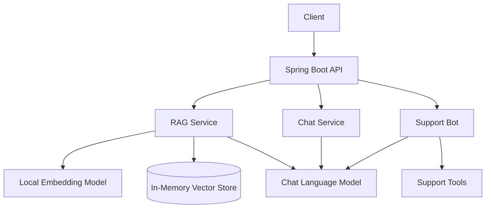

# AI Assistant Platform

[](https://github.com/kazimdafedar/ai-assistant-platform/actions/workflows/ci.yml)
[](https://openjdk.org/)
[](https://spring.io/projects/spring-boot)
[](https://docs.langchain4j.dev/)
[](LICENSE)

Modular **AI backend in pure Java** — RAG document Q&A, ChatGPT-like chat with memory, and a customer-support bot with tool calling. Built with **Spring Boot + LangChain4j**.

Complements [java-compute](https://github.com/kazimdafedar/java-compute) and [expense-tracker-api](https://github.com/kazimdafedar/expense-tracker-api).

## Modules

| Module | Endpoint prefix | What it demonstrates |
|--------|-----------------|----------------------|
| **RAG** | `/api/rag` | Document ingest, vector search, grounded answers with citations |
| **Chat** | `/api/chat` | Multi-turn conversation with session memory |
| **Support Bot** | `/api/support` | Tool calling (order lookup, tickets) + human escalation |

## Architecture



## Tech stack

- Java 17 · Spring Boot 3 · LangChain4j 0.36
- Local embeddings (AllMiniLM L6 v2) — works offline
- OpenAI GPT (optional) — set `OPENAI_API_KEY` + `APP_DEMO_MODE=false`
- Swagger UI · JUnit 5 · GitHub Actions CI · Docker

## Quick start

```bash
git clone https://github.com/kazimdafedar/ai-assistant-platform.git
cd ai-assistant-platform
mvn spring-boot:run
```

Swagger UI: http://localhost:8081/swagger-ui.html

### Demo mode (default — no API key needed)

Works out of the box with a local demo LLM and local embeddings.

### Production mode (OpenAI)

```bash
export OPENAI_API_KEY=sk-your-key
export APP_DEMO_MODE=false
mvn spring-boot:run
```

## API examples

### 1. RAG — ingest a document

```bash
curl -X POST http://localhost:8081/api/rag/documents \
  -H "Content-Type: application/json" \
  -d '{"title":"Refund Policy","content":"Customers can request a refund within 30 days."}'
```

### 2. RAG — ask a question

```bash
curl -X POST http://localhost:8081/api/rag/ask \
  -H "Content-Type: application/json" \
  -d '{"question":"What is the refund window?"}'
```

### 3. Chat — conversational

```bash
curl -X POST http://localhost:8081/api/chat \
  -H "Content-Type: application/json" \
  -d '{"message":"Hello, what can you help with?"}'
```

### 4. Support bot — order lookup / escalation

```bash
curl -X POST http://localhost:8081/api/support/chat \
  -H "Content-Type: application/json" \
  -d '{"message":"What is the status of order ORD-1001?"}'
```

## Docker

```bash
docker build -t ai-assistant-platform .
docker run -p 8081:8081 ai-assistant-platform
```

## Project structure

```
src/main/java/com/kazim/aiassistant/
├── config/       LangChain4j beans, demo LLM
├── rag/          Document ingestion + RAG Q&A
├── chat/         Session-based chat
└── support/      Support bot + tools
```

## Roadmap

- [ ] Streaming chat responses (SSE)
- [ ] pgvector for persistent embeddings
- [ ] PDF document upload
- [ ] AWS deployment

## Author

**Kazim Dafedar** — [LinkedIn](https://www.linkedin.com/in/kazim-dafedar/) · [GitHub](https://github.com/kazimdafedar)

## License

MIT — see [LICENSE](LICENSE).
