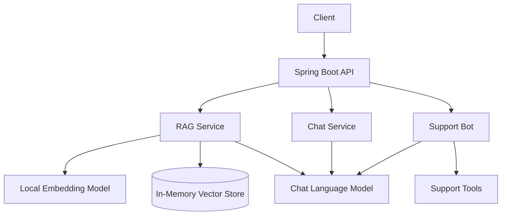

# AI Assistant Platform

[](https://github.com/kazimdafedar/ai-assistant-platform/actions/workflows/ci.yml)
[](https://openjdk.org/)
[](https://spring.io/projects/spring-boot)
[](https://docs.langchain4j.dev/)
[](LICENSE)

Modular **AI backend in pure Java** — RAG document Q&A, ChatGPT-like chat with memory, and a customer-support bot with tool calling. Built with **Spring Boot + LangChain4j**.

Complements [java-compute](https://github.com/kazimdafedar/java-compute) and [expense-tracker-api](https://github.com/kazimdafedar/expense-tracker-api).

## Modules

| Module | Endpoint prefix | What it demonstrates |
|--------|-----------------|----------------------|
| **RAG** | `/api/rag` | Document ingest, vector search, grounded answers with citations |
| **Chat** | `/api/chat` | Multi-turn conversation with session memory |
| **Support Bot** | `/api/support` | Tool calling (order lookup, tickets) + human escalation |

## Architecture



## Tech stack

- Java 25 · Spring Boot 3 · LangChain4j 0.36
- Local embeddings (AllMiniLM L6 v2) — works offline
- OpenAI GPT (optional) — set `OPENAI_API_KEY` + `APP_DEMO_MODE=false`
- Swagger UI · JUnit 5 · GitHub Actions CI · Docker

## Prerequisites

- **JDK 25** (or newer)
- **Maven 3.9+**

## Running the application

### Demo mode (default — free, no OpenAI)

Demo mode is the **default** and requires **no API key, no billing, and no network calls to OpenAI**. The app uses a local demo LLM plus on-device embeddings, so you can explore every endpoint immediately.

```bash
git clone https://github.com/kazimdafedar/ai-assistant-platform.git
cd ai-assistant-platform
mvn spring-boot:run
```

Or explicitly enable demo mode:

```bash
export APP_DEMO_MODE=true   # optional — this is already the default
mvn spring-boot:run
```

Swagger UI: http://localhost:8081/swagger-ui.html

**What demo mode provides:**

- Fully functional REST API for RAG, chat, and support-bot flows
- Local vector embeddings (AllMiniLM) — no external embedding API
- Deterministic demo LLM responses prefixed with `[Demo mode — …]`
- Ideal for local development, CI, portfolio demos, and LinkedIn walkthroughs

**Placeholder keys are handled safely.** If you set `APP_DEMO_MODE=false` but provide a blank, example, or placeholder key (e.g. `sk-your-key` from documentation), the app **automatically falls back to demo mode** instead of calling OpenAI.

### Real OpenAI mode (production LLM)

Use this when you want ChatGPT-quality responses from OpenAI models.

**Requirements:**

- A **valid** OpenAI API key (`sk-…`, not a documentation placeholder)
- **Billing enabled** with available credits on your OpenAI account
- Optional: `OPENAI_CHAT_MODEL` (defaults to `gpt-4o-mini`)

```bash
git clone https://github.com/kazimdafedar/ai-assistant-platform.git
cd ai-assistant-platform

export OPENAI_API_KEY=sk-proj-...your-real-key...
export APP_DEMO_MODE=false
# optional: export OPENAI_CHAT_MODEL=gpt-4o-mini

mvn spring-boot:run
```

Do **not** copy placeholder values like `sk-your-key` — those are documentation examples only and will trigger demo-mode fallback.

### Environment variables

| Variable | Default | Description |
|----------|---------|-------------|
| `APP_DEMO_MODE` | `true` | When `true`, uses the local demo LLM (no OpenAI). Set to `false` for real OpenAI responses. |
| `OPENAI_API_KEY` | _(empty)_ | Your OpenAI API key. Required when `APP_DEMO_MODE=false` with a usable key. |
| `OPENAI_CHAT_MODEL` | `gpt-4o-mini` | OpenAI chat model name (production mode only). |
| `PORT` | `8081` | HTTP server port. |

### Quota, billing, and error handling

When running in **real OpenAI mode**, API failures are returned as **HTTP 503** with a JSON body explaining the issue:

| Scenario | HTTP status | Response |
|----------|-------------|----------|
| Invalid or missing API key | 503 | `"OpenAI authentication failed"` — check `OPENAI_API_KEY` or switch to demo mode |
| Insufficient quota / no credits | 503 | `"OpenAI quota exceeded"` — add credits at [OpenAI billing](https://platform.openai.com/account/billing) or set `APP_DEMO_MODE=true` |
| Other OpenAI errors | 503 | `"OpenAI request failed"` — includes the upstream HTTP code |

If you see `insufficient_quota`, your key is valid but the account has no prepaid balance or has hit a spend cap. Either add credits, or switch back to demo mode:

```bash
export APP_DEMO_MODE=true
unset OPENAI_API_KEY   # optional
mvn spring-boot:run
```

## Build and test

```bash
mvn test          # unit and integration tests
mvn verify        # full build (same as CI)
```

## API examples

### 1. RAG — ingest a document

```bash
curl -X POST http://localhost:8081/api/rag/documents \
  -H "Content-Type: application/json" \
  -d '{"title":"Refund Policy","content":"Customers can request a refund within 30 days."}'
```

### 2. RAG — ask a question

```bash
curl -X POST http://localhost:8081/api/rag/ask \
  -H "Content-Type: application/json" \
  -d '{"question":"What is the refund window?"}'
```

### 3. Chat — conversational

```bash
curl -X POST http://localhost:8081/api/chat \
  -H "Content-Type: application/json" \
  -d '{"message":"Hello, what can you help with?"}'
```

### 4. Support bot — order lookup / escalation

```bash
curl -X POST http://localhost:8081/api/support/chat \
  -H "Content-Type: application/json" \
  -d '{"message":"What is the status of order ORD-1001?"}'
```

## Docker

Demo mode is the default inside the container as well — no API key required:

```bash
docker build -t ai-assistant-platform .
docker run -p 8081:8081 ai-assistant-platform
```

For OpenAI mode, pass environment variables at runtime:

```bash
docker run -p 8081:8081 \
  -e APP_DEMO_MODE=false \
  -e OPENAI_API_KEY=sk-proj-...your-real-key... \
  ai-assistant-platform
```

## Project structure

```
src/main/java/com/kazim/aiassistant/
├── config/       LangChain4j beans, demo LLM, OpenAI error handling
├── rag/          Document ingestion + RAG Q&A
├── chat/         Session-based chat
└── support/      Support bot + tools
```

## Roadmap

- [ ] Streaming chat responses (SSE)
- [ ] pgvector for persistent embeddings
- [ ] PDF document upload
- [ ] AWS deployment

## Author

**Kazim Dafedar** — [LinkedIn](https://www.linkedin.com/in/kazim-dafedar/) · [GitHub](https://github.com/kazimdafedar)

## License

MIT — see [LICENSE](LICENSE).
